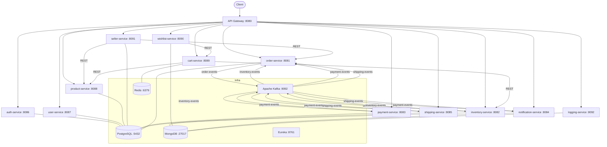
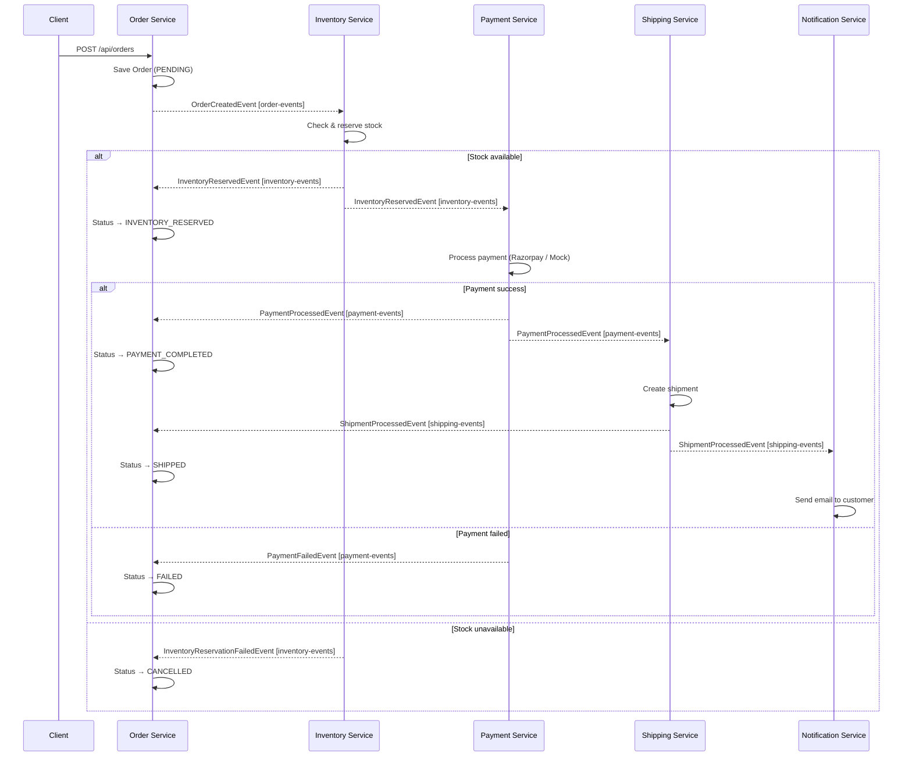

<div align="center">

# E-Commerce Microservices Platform

A production-grade, event-driven e-commerce backend built with Spring Boot microservices.
Services communicate asynchronously via Apache Kafka (saga pattern) and synchronously via REST
through a central API Gateway with JWT authentication.

*"Polyglot Persistence · Choreography-Based Saga · Zero-Downtime Kubernetes Deployments"*

---

### Language 🛠️


### Framework & Cloud 🛠️


### Infrastructure 🛠️


### Observability & Tools 🛠️


</div>

---

## 📋 Table of Contents

- [Key Highlights](#-key-highlights)
- [Architecture](#-architecture)
- [Order Saga Flow](#-order-saga-flow)
- [🚀 Quick Start](#-quick-start)
- [Service Port Reference](#-service-port-reference)
- [Services](#-services)
  - [Service Registry](#1-service-registry)
  - [API Gateway](#2-api-gateway)
  - [Common Library](#3-common-library)
  - [Auth Service](#4-auth-service)
  - [User Service](#5-user-service)
  - [Product Service](#6-product-service)
  - [Seller Service](#7-seller-service)
  - [Cart Service](#8-cart-service)
  - [Wishlist Service](#9-wishlist-service)
  - [Order Service](#10-order-service)
  - [Inventory Service](#11-inventory-service)
  - [Payment Service](#12-payment-service)
  - [Shipping Service](#13-shipping-service)
  - [Notification Service](#14-notification-service)
  - [Logging Service](#15-logging-service)
- [Kafka Topics](#-kafka-topics)
- [Kubernetes](#-kubernetes)
- [Project Structure](#-project-structure)
- [Tech Stack](#-tech-stack)

---

## ✨ Key Highlights

- **Event-Driven Saga** — Checkout flows are orchestrated through Kafka events with automatic compensating rollbacks. No single point of failure.
- **Polyglot Persistence** — Each service owns its data store. PostgreSQL for transactions, MongoDB for documents, Redis for session cache.
- **Gateway-Level Security** — JWT is validated once at the API Gateway. All downstream services receive trusted identity headers — no repeated token parsing.
- **Kubernetes-Ready** — HPA-configured with CPU/memory scaling, zero-downtime rolling updates, liveness/readiness probes, and Prometheus scraping out of the box.
- **Full Observability** — A dedicated logging service aggregates structured logs across all 15 services with cross-service traceId correlation and a 30-day TTL.

---

## 🏗️ Architecture



---

## 🔄 Order Saga Flow

The core checkout flow uses a **choreography-based saga** — no central orchestrator. Each service reacts to events and publishes the next event in the chain.



---

## 🚀 Quick Start

The fastest way to run Zexxity is with Docker Compose. It spins up Kafka (KRaft), PostgreSQL (7 databases), MongoDB, Redis, and Kafka UI — no manual database setup required.

### Prerequisites

| Tool | Version |
|---|---|
| Java | 21+ |
| Docker Desktop | Latest |
| Maven | 3.9+ |

### 1. Configure Environment

Create a `.env` file in the project root:

```env
# Database
DB_HOST=localhost
DB_PORT=5432
DB_USER=postgres
DB_PASSWORD=postgres123

# JWT — HMAC-SHA256 Base64-encoded secret
JWT_SECRET=your_jwt_secret_here

# Google OAuth2
GOOGLE_CLIENT_ID=your_google_client_id
GOOGLE_CLIENT_SECRET=your_google_client_secret

# Razorpay (payment gateway)
RAZORPAY_KEY_ID=your_razorpay_key_id
RAZORPAY_KEY_SECRET=your_razorpay_key_secret

# Email — auth-service (AWS SES)
MAIL_USERNAME=your_ses_smtp_username
MAIL_PASSWORD=your_ses_smtp_password

# Email — notification-service (Resend)
RESEND_API_KEY=your_resend_api_key
```

### 2. Start Infrastructure

```bash
docker-compose up -d
```

This starts:

| Container | Port | Notes |
|---|---|---|
| Kafka (KRaft) | `9092` | No ZooKeeper required |
| PostgreSQL 16 | `5432` | Auto-creates 7 databases |
| MongoDB | `27017` | |
| Redis 7 | `6379` | Persistence enabled |
| Kafka UI | `8071` | http://localhost:8071 |

### 3. Build All Modules

```bash
./mvnw clean install -DskipTests
```

### 4. Start Services (in order)

```
1. service-registry     ← Eureka must be up first
2. api-gateway
3. auth-service
4. All remaining services (any order)
```

> **Kafka reset on Windows?** Run `FIX-KAFKA.ps1` (PowerShell) or `FIX-KAFKA.bat`.

---

## 📡 Service Port Reference

| Service | Port | Database |
|---|---|---|
| service-registry | `8761` | — |
| api-gateway | `8080` | — |
| auth-service | `8086` | PostgreSQL `auth_db` |
| user-service | `8087` | PostgreSQL `user_db` |
| product-service | `8088` | PostgreSQL `product_db` |
| seller-service | `8091` | PostgreSQL `seller_db` |
| cart-service | `8089` | Redis |
| wishlist-service | `8090` | MongoDB `wishlist_db` |
| order-service | `8081` | PostgreSQL `order_db` |
| inventory-service | `8082` | MongoDB `inventory` |
| payment-service | `8083` | PostgreSQL `payment_db` |
| shipping-service | `8085` | PostgreSQL `shipping_db` |
| notification-service | `8084` | MongoDB `notification_db` |
| logging-service | `8092` | MongoDB `logging_db` |
| Kafka UI | `8071` | — |

All services register with Eureka and are reachable through the API Gateway at `http://localhost:8080`.

---

## 🧩 Services

---

### 1. Service Registry

**Port:** `8761` &nbsp;|&nbsp; Eureka Server

Central service discovery. Every microservice registers here on startup and the API Gateway uses it for load-balanced routing (`lb://service-name`).

- Dashboard: http://localhost:8761
- Infrastructure only — no REST API.

---

### 2. API Gateway

**Port:** `8080` &nbsp;|&nbsp; Spring Cloud Gateway

Single entry point for all client traffic. Validates JWT and injects identity headers (`X-User-Id`, `X-User-Email`, `X-User-Role`) into every downstream request.

**JWT Validation**
- Algorithm: HMAC-SHA256
- Token source: `Authorization: Bearer <token>`
- Success → injects identity headers
- Failure → `401 Unauthorized`

**Route Table**

| Path | Service | JWT |
|---|---|---|
| `/api/auth/**` | auth-service | ❌ |
| `/api/products/**` GET | product-service | ❌ |
| `/api/orders/**` | order-service | ✅ |
| `/api/payments/**` | payment-service | ✅ |
| `/api/inventory/**` | inventory-service | ✅ |
| `/api/shipping/**` | shipping-service | ✅ |
| `/api/users/**` | user-service | ✅ |
| `/api/cart/**` | cart-service | ✅ |
| `/api/wishlist/**` | wishlist-service | ✅ |
| `/api/seller/**` | seller-service | ✅ |
| `/api/notifications/**` | notification-service | ✅ |
| `/api/logs/**` | logging-service | ✅ |

---

### 3. Common Library

**Type:** Shared Maven module (no server)

Contains all shared Kafka event classes and DTOs. Every saga participant imports this library, ensuring type-safe event contracts across services.

**Base Event** (all events extend `BaseEvent`)

| Field | Type | Purpose |
|---|---|---|
| `eventId` | UUID | Unique event identifier |
| `correlationId` | UUID | Links all events in one saga transaction |
| `timestamp` | Instant | Event creation time |

**Kafka Events**

| Class | Topic | Key Fields |
|---|---|---|
| `OrderCreatedEvent` | `order-events` | orderId, customerId, items, totalAmount |
| `InventoryReservedEvent` | `inventory-events` | orderId, customerId, totalAmount |
| `InventoryReservationFailedEvent` | `inventory-events` | orderId, reason |
| `PaymentProcessedEvent` | `payment-events` | orderId, paymentId, customerId |
| `PaymentFailedEvent` | `payment-events` | orderId, reason |
| `ShipmentProcessedEvent` | `shipping-events` | orderId, shipmentId, trackingNumber |
| `ShipmentFailedEvent` | `shipping-events` | orderId, reason |

---

### 4. Auth Service

**Port:** `8086` &nbsp;|&nbsp; **Database:** PostgreSQL `auth_db`

Handles registration, email OTP verification, login, JWT issuance, refresh token rotation, password reset, and Google OAuth2.

| Token | Lifetime |
|---|---|
| Access token | 15 minutes |
| Refresh token | 7 days (rotated on each use) |
| OTP | 15 minutes (6-digit, via AWS SES) |

**API Endpoints**

| Method | Path | Auth | Description |
|---|---|---|---|
| POST | `/api/auth/register` | Public | Register — sends email OTP |
| POST | `/api/auth/verify-email` | Public | Verify with OTP |
| POST | `/api/auth/login` | Public | Login → accessToken + refreshToken |
| POST | `/api/auth/refresh` | Public | Rotate refresh token |
| POST | `/api/auth/logout` | Public | Revoke refresh token |
| POST | `/api/auth/forgot-password` | Public | Send reset OTP |
| POST | `/api/auth/reset-password` | Public | Reset with OTP |
| GET | `/api/auth/me` | JWT | Get current user |
| GET | `/api/auth/oauth2/authorize/google` | Public | Start Google OAuth2 |

**Login Response**
```json
{
  "accessToken": "eyJ...",
  "refreshToken": "uuid-token",
  "tokenType": "Bearer",
  "expiresIn": 900,
  "userId": "uuid",
  "email": "john@example.com",
  "role": "ROLE_USER"
}
```

<details>
<summary>Database Schema</summary>

`users` table

| Column | Type | Notes |
|---|---|---|
| id | UUID PK | auto-generated |
| name | VARCHAR | |
| email | VARCHAR UNIQUE | |
| password_hash | VARCHAR | null for OAuth2 users |
| provider | ENUM | LOCAL, GOOGLE |
| role | ENUM | ROLE_USER, ROLE_SELLER, ROLE_ADMIN |
| email_verified | BOOLEAN | |
| otp / otp_expires_at | VARCHAR / TIMESTAMP | 15-min window |

`refresh_tokens` table

| Column | Type | Notes |
|---|---|---|
| id | UUID PK | |
| token | VARCHAR UNIQUE | |
| user_id | UUID FK → users | |
| expires_at | TIMESTAMP | |
| revoked | BOOLEAN | |

</details>

---

### 5. User Service

**Port:** `8087` &nbsp;|&nbsp; **Database:** PostgreSQL `user_db`

Manages user profiles and shipping addresses. Uses the `X-User-Id` header (injected by gateway) to identify callers — shares the same UUID as auth-service.

**API Endpoints**

| Method | Path | Description |
|---|---|---|
| POST/GET/PUT | `/api/users/profile` | Create / read / update profile |
| DELETE | `/api/users/profile` | Deactivate account |
| PATCH | `/api/users/profile/preferences` | Language, currency, notifications |
| GET/POST | `/api/users/addresses` | List / add addresses |
| PUT/DELETE | `/api/users/addresses/{id}` | Update / delete address |
| PATCH | `/api/users/addresses/{id}/default` | Set default address |

---

### 6. Product Service

**Port:** `8088` &nbsp;|&nbsp; **Database:** PostgreSQL `product_db`

Full product catalog with category hierarchy, full-text search, price filtering, pagination, and sorting.

**API Endpoints**

| Method | Path | Description |
|---|---|---|
| POST | `/api/products` | Create product (seller only) |
| POST | `/api/products/bulk` | Bulk create |
| GET | `/api/products/{id}` | Get by ID or SKU |
| PUT/PATCH/DELETE | `/api/products/{id}` | Update / change status / delete |
| GET | `/api/products` | Search with filters |
| GET | `/api/products/my-products` | Seller's own listings |

**Search params:** `keyword`, `categoryId`, `minPrice`, `maxPrice`, `brand`, `page`, `size`, `sortBy`, `sortDir`

---

### 7. Seller Service

**Port:** `8091` &nbsp;|&nbsp; **Database:** PostgreSQL `seller_db`

Merchant profile management and verification lifecycle. Delegates product and order lookups to their respective services via REST.

**API Endpoints**

| Method | Path | Description |
|---|---|---|
| POST | `/api/seller/register` | Register as seller |
| GET/PUT | `/api/seller/profile` | View / update store profile |
| GET | `/api/seller/products` | Seller's product listings |
| GET | `/api/seller/orders` | Orders with seller's items |
| GET | `/api/seller/analytics` | Revenue, order count, avg value |
| GET/POST | `/api/admin/sellers/**` | Admin verification |

**Verification status:** `PENDING → VERIFIED / REJECTED / SUSPENDED`

---

### 8. Cart Service

**Port:** `8089` &nbsp;|&nbsp; **Database:** Redis (TTL: 7 days)

Session-based cart stored in Redis. Validates stock with inventory-service before adding items.

**API Endpoints**

| Method | Path | Description |
|---|---|---|
| GET | `/api/cart` | Get cart (auto-created if empty) |
| POST | `/api/cart/items` | Add item (validates stock) |
| PUT | `/api/cart/items/{productId}` | Update quantity |
| DELETE | `/api/cart/items/{productId}` | Remove item |
| DELETE | `/api/cart` | Clear cart |

**Redis key:** `cart:{userId}` → serialized `Cart` JSON

---

### 9. Wishlist Service

**Port:** `8090` &nbsp;|&nbsp; **Database:** MongoDB `wishlist_db`

Save products for later. Compound unique index on `{userId, productId}` prevents duplicates (returns `409`). Supports one-click move-to-cart.

**API Endpoints**

| Method | Path | Description |
|---|---|---|
| POST | `/api/wishlist/add` | Add to wishlist |
| DELETE | `/api/wishlist/remove/{productId}` | Remove |
| GET | `/api/wishlist/{userId}` | Get full wishlist |
| POST | `/api/wishlist/move-to-cart/{productId}` | Move to cart |

---

### 10. Order Service

**Port:** `8081` &nbsp;|&nbsp; **Database:** PostgreSQL `order_db`

Creates orders and drives the entire saga by publishing `OrderCreatedEvent` then reacting to events from three downstream services.

**API Endpoints**

| Method | Path | Description |
|---|---|---|
| POST | `/api/orders` | Place order — triggers saga |
| GET | `/api/orders/{orderId}` | Get by ID |
| GET | `/api/orders/customer/{customerId}` | Orders by customer |

**Kafka:** Publishes → `order-events` &nbsp;|&nbsp; Consumes → `inventory-events`, `payment-events`, `shipping-events`

**Order Status Lifecycle**

```
PENDING → INVENTORY_CHECKING → INVENTORY_RESERVED → PAYMENT_PROCESSING
       → PAYMENT_COMPLETED → SHIPPING_PROCESSING → SHIPPED → COMPLETED
                                                 ↘ CANCELLED (inventory fail)
                                                 ↘ FAILED (payment / shipping fail)
```

---

### 11. Inventory Service

**Port:** `8082` &nbsp;|&nbsp; **Database:** MongoDB `inventory`

Manages stock levels. Reserves stock on order, publishes success/failure, and emits low-stock alerts below a configurable threshold.

**API Endpoints**

| Method | Path | Description |
|---|---|---|
| POST/GET | `/api/inventory` | Create / list records |
| GET | `/api/inventory/product/{productId}` | Stock by product |
| POST | `/api/inventory/{id}/restock` | Add units |
| GET | `/api/inventory/check` | Check availability |
| GET | `/api/inventory/low-stock` | Low stock items |

**Kafka:** Consumes → `order-events` &nbsp;|&nbsp; Publishes → `inventory-events`, `inventory-alerts`

---

### 12. Payment Service

**Port:** `8083` &nbsp;|&nbsp; **Database:** PostgreSQL `payment_db`

Supports Razorpay, Stripe, and a Mock adapter. Handles automatic saga-driven payments and manual frontend-initiated flows with refund support.

**Payment Adapters:** Razorpay · Stripe (stub) · Mock (dev/test)

**API Endpoints**

| Method | Path | Description |
|---|---|---|
| POST | `/api/payments/initiate` | Create gateway order |
| POST | `/api/payments/verify` | Verify signature & capture |
| POST | `/api/payments/refund` | Full or partial refund |
| GET | `/api/payments/{paymentId}` | Get payment |
| GET | `/api/payments/order/{orderId}` | Payment by order |

**Kafka:** Consumes → `inventory-events` &nbsp;|&nbsp; Publishes → `payment-events`

**Status:** `PENDING → AUTHORIZED → COMPLETED / FAILED / REFUND_PENDING → REFUNDED`

---

### 13. Shipping Service

**Port:** `8085` &nbsp;|&nbsp; **Database:** PostgreSQL `shipping_db`

Creates shipments when payment completes. Assigns tracking numbers and carrier, then publishes `ShipmentProcessedEvent`.

**API Endpoints**

| Method | Path | Description |
|---|---|---|
| GET | `/api/shipping/{shipmentId}` | Get shipment |
| GET | `/api/shipping/order/{orderId}` | Shipment by order |

**Kafka:** Consumes → `payment-events` &nbsp;|&nbsp; Publishes → `shipping-events`

---

### 14. Notification Service

**Port:** `8084` &nbsp;|&nbsp; **Database:** MongoDB `notification_db`

Sends transactional emails via Resend and stores in-app notifications. Failed deliveries are retried up to 3 times via a scheduled job.

**API Endpoints**

| Method | Path | Description |
|---|---|---|
| GET | `/api/notifications` | All notifications |
| GET | `/api/notifications/unread` | Unread only |
| GET | `/api/notifications/unread/count` | Badge count |
| PATCH | `/api/notifications/{id}/read` | Mark as read |
| PATCH | `/api/notifications/read-all` | Mark all read |

**Kafka:** Consumes → `order-events`, `payment-events`, `shipping-events`

**Email types:** `ORDER_PLACED · PAYMENT_SUCCESS · PAYMENT_FAILED · ORDER_SHIPPED · ORDER_DELIVERED`

---

### 15. Logging Service

**Port:** `8092` &nbsp;|&nbsp; **Database:** MongoDB `logging_db`

Intercepts all Kafka business events and converts them into structured log entries with cross-service traceId correlation. Logs are auto-expired after **30 days** via a MongoDB TTL index.

**API Endpoints**

| Method | Path | Description |
|---|---|---|
| GET | `/api/logs` | Search (serviceName, level, keyword, traceId, date range) |
| GET | `/api/logs/{id}` | Single entry |
| GET | `/api/logs/trace/{traceId}` | All logs for one saga |
| GET | `/api/logs/stats` | Aggregated stats per service/level |
| GET | `/api/logs/errors/recent` | Recent errors for monitoring |

**Kafka:** Consumes → `service-logs`, `order-events`, `payment-events`, `inventory-events`, `shipping-events`

---

## 📨 Kafka Topics

| Topic | Producer | Consumers | Events |
|---|---|---|---|
| `order-events` | order-service | inventory-service, logging-service | `OrderCreatedEvent` |
| `inventory-events` | inventory-service | order-service, payment-service, logging-service | `InventoryReservedEvent`, `InventoryReservationFailedEvent` |
| `inventory-alerts` | inventory-service | ops / monitoring | Low-stock alerts |
| `payment-events` | payment-service | order-service, shipping-service, notification-service, logging-service | `PaymentProcessedEvent`, `PaymentFailedEvent` |
| `shipping-events` | shipping-service | order-service, notification-service, logging-service | `ShipmentProcessedEvent`, `ShipmentFailedEvent` |
| `service-logs` | any service | logging-service | Explicit log entries |
| `wishlist-events` | wishlist-service | future use | Wishlist activity |

**Kafka configuration (docker-compose)**

| Property | Value |
|---|---|
| Mode | KRaft — no ZooKeeper |
| External port | `9092` |
| Internal port | `29092` (container-to-container) |
| Auto topic creation | Enabled |
| UI | http://localhost:8071 |

---

## ☸️ Kubernetes

Manifests live in `/k8s`. The order-service is the reference deployment and demonstrates the standard pattern for any service.

**HPA — order-service**

| Property | Value |
|---|---|
| Min replicas | 2 |
| Max replicas | 8 |
| Scale-up trigger | CPU > 60% or Memory > 70% |
| Scale-up speed | +2 pods / 30 s (max 100% increase / 60 s) |
| Scale-down cooldown | 120 s stabilization |

**Deployment features**

- Zero-downtime rolling update (`maxUnavailable: 0`, `maxSurge: 1`)
- `preStop` sleep of 10 s to drain connections before SIGTERM
- Separate startup, liveness, and readiness probes via `/actuator/health`
- Prometheus scraping annotations on pod template
- Pod anti-affinity to spread replicas across nodes

**Deploy**

```bash
# 1. Build image
cd order-service
docker build -t order-service:latest .

# 2. Apply manifests
kubectl apply -f k8s/order-deployment.yaml
kubectl apply -f k8s/order-service.yaml
kubectl apply -f k8s/order-hpa.yaml
```

> To containerize any other service: add a `Dockerfile`, create `application-k8s.yml` with overrides, then add `Deployment` + `Service` + `HPA` manifests to `/k8s`.

---

## 📁 Project Structure

```
ecommerce-microservices/
├── pom.xml                      # Parent POM — Java 21, Spring Boot 3.2.12
├── docker-compose.yml           # Kafka, PostgreSQL, MongoDB, Redis, Kafka UI
├── .env                         # Environment variables
├── scripts/
│   └── create-multiple-postgres-dbs.sh  # Auto-creates 7 PostgreSQL databases
├── k8s/                         # Kubernetes manifests (order-service reference)
├── common-library/              # Shared Kafka events & DTOs
├── service-registry/            # Eureka server
├── api-gateway/                 # Spring Cloud Gateway + JWT filter
├── auth-service/                # Authentication, JWT, OAuth2
├── user-service/                # User profiles & addresses
├── product-service/             # Product catalog & categories
├── seller-service/              # Merchant management & verification
├── cart-service/                # Redis shopping cart
├── wishlist-service/            # MongoDB wishlists
├── order-service/               # Orders + saga orchestration
├── inventory-service/           # Stock management
├── payment-service/             # Razorpay / Stripe / Mock payments
├── shipping-service/            # Shipment tracking
├── notification-service/        # Email + in-app notifications
└── logging-service/             # Centralized log aggregation (30-day TTL)
```

---

## 🛠️ Tech Stack

| Category | Technology |
|---|---|
| Language | Java 21 |
| Framework | Spring Boot 3.2.12, Spring Cloud 2023.0.2 |
| Service Discovery | Netflix Eureka |
| API Gateway | Spring Cloud Gateway |
| Messaging | Apache Kafka (KRaft, Confluent 7.5.0) |
| Relational DB | PostgreSQL 16 (7 isolated databases) |
| Document DB | MongoDB (4 databases) |
| Cache | Redis 7 |
| Auth | JWT (JJWT 0.12), Spring Security, Google OAuth2 |
| Payment | Razorpay, Stripe (stub), Mock |
| Email | AWS SES (auth-service), Resend (notification-service) |
| Build | Maven multi-module |
| Containerization | Docker Compose, Kubernetes (HPA) |
| Code Generation | Lombok, MapStruct |

---

<div align="center">

Built with ☕ and Spring Boot &nbsp;·&nbsp; Java 21 &nbsp;·&nbsp; Apache Kafka

</div>
