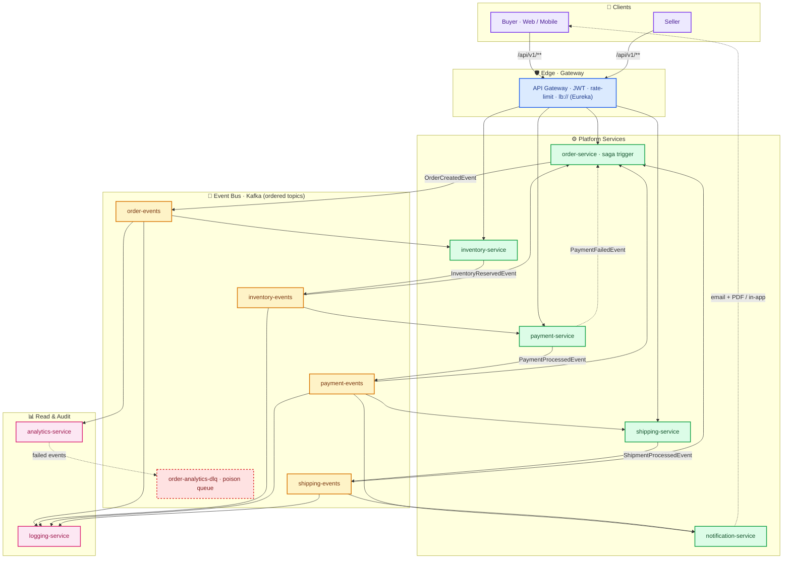
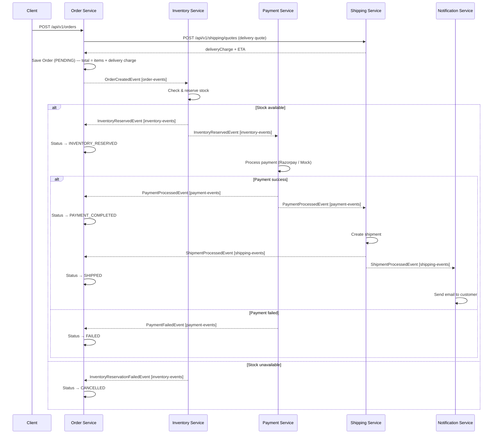

# EventDrivenMesh — Architecture

> System topology, high-level design, the checkout saga, and the microservice catalog.
> Service-level API docs, ports, quick start, and operations guides live in the [README](README.md).

---

## 🏗️ System Topology

```mermaid
graph TB
    Client([Client]) --> GW[API Gateway :8080]

    subgraph Infra
        KAFKA[Apache Kafka :9095]
        PG[(PostgreSQL :5432)]
        MONGO[(MongoDB :27017)]
        REDIS[(Redis :6379)]
        EUREKA[Eureka :8761]
    end

    GW --> AUTH[auth-service :8086]
    GW --> USER[user-service :8087]
    GW --> PRODUCT[product-service :8088]
    GW --> SELLER[seller-service :8091]
    GW --> CART[cart-service :8089]
    GW --> WISH[wishlist-service :8090]
    GW --> ORDER[order-service :8081]
    GW --> INV[inventory-service :8082]
    GW --> PAY[payment-service :8083]
    GW --> SHIP[shipping-service :8085]
    GW --> NOTIF[notification-service :8084]
    GW --> LOG[logging-service :8092]
    GW --> ANALYTICS[analytics-service :8093]

    ORDER -- order-events --> KAFKA
    KAFKA -- order-events --> INV
    INV -- inventory-events --> KAFKA
    KAFKA -- inventory-events --> ORDER
    KAFKA -- inventory-events --> PAY
    PAY -- payment-events --> KAFKA
    KAFKA -- payment-events --> ORDER
    KAFKA -- payment-events --> SHIP
    KAFKA -- payment-events --> NOTIF
    SHIP -- shipping-events --> KAFKA
    KAFKA -- shipping-events --> ORDER
    KAFKA -- shipping-events --> NOTIF
    KAFKA -- order-events --> ANALYTICS
    ANALYTICS -- order-analytics-dlq --> KAFKA
    KAFKA -- order-events --> LOG
    KAFKA -- inventory-events --> LOG
    KAFKA -- payment-events --> LOG
    KAFKA -- shipping-events --> LOG
    KAFKA -- service-logs --> LOG

    WISH -- REST --> CART
    SELLER -- REST --> PRODUCT
    SELLER -- REST --> ORDER
    CART -- REST --> PRODUCT
    CART -- REST --> INV
    ORDER -- REST --> SHIP

    AUTH --- PG
    USER --- PG
    PRODUCT --- PG
    SELLER --- PG
    ORDER --- PG
    PAY --- PG
    SHIP --- PG
    ANALYTICS --- PG
    INV --- MONGO
    WISH --- MONGO
    NOTIF --- MONGO
    LOG --- MONGO
    CART --- REDIS
```



---

## 🧭 High-Level Design (HLD)

### 1. Context & Actors

EventDrivenMesh is a headless e-commerce backend. Clients never talk to a service directly — every request enters through the **API Gateway**, which authenticates, rate-limits, and routes to a service via Eureka/`lb://`. Long-running business operations (placing an order) are decomposed into a chain of Kafka events: each service performs one step and publishes the event that triggers the next.

| Actor / System | Role |
|---|---|
| Buyer (Web / Mobile) | Browse catalog, manage cart & wishlist, place orders, complete Razorpay checkout |
| Seller | Store profile, product management, order & revenue views |
| Admin | Seller verification, platform monitoring |
| Razorpay | External PSP — gateway orders, captures, signed webhooks |
| Resend / AWS SES | Transactional email (notifications, auth OTP), PDF invoices |
| Google OAuth2 | Federated identity |

### 2. Design Principles

| Principle | How it is applied |
|---|---|
| Event-driven, choreographed microservices | **No central saga orchestrator.** Each service reacts to one event and produces the next (`order → inventory → payment → shipping → notification`) |
| Polyglot persistence | PostgreSQL for transactional state, MongoDB for documents & logs, Redis for ephemeral session cart |
| Sync only where it pays | REST is confined to the gateway edges and cheap internal lookups (cart→product, cart→inventory, seller→product/order, order→shipping delivery quote); every state transition is a Kafka event |
| CQRS | `analytics-service` keeps a dedicated PostgreSQL read model projected from `order-events`, never touching transactional DBs |
| Idempotent by design | Events carry `eventId`/`correlationId`; analytics de-duplicates on `event_id`; payment rows are keyed by `correlation_id` |
| Zero-trust at the edge | Gateway validates JWT once and injects `X-User-Id` / `X-User-Email` / `X-User-Role`; downstream services trust these headers |
| 12-factor config | All credentials via environment (`RAZORPAY_*`, `RESEND_API_KEY`, `MAIL_PASSWORD`, `JWT_SECRET`, …) with sensible dev defaults |

### 3. Logical Architecture

**Two cooperating planes.** One edge for HTTP, one backbone for events:
- **Sync plane** — the *entry surface*. The **API Gateway** validates the JWT once, applies rate limits, and routes every request to `/api/v1/**` over Eureka/`lb://`; downstream services trust the injected `X-User-Id` / `X-User-Email` / `X-User-Role` headers. The same plane serves cheap internal reads (`cart`→`product`/`inventory`, `seller`→`product`/`order`, `order`→`shipping` delivery quote).
- **Async plane** — the *saga backbone*. No central orchestrator — the saga is choreographed: each service consumes the one event it needs, performs a step, and publishes the event that triggers the next (`order → inventory → payment → shipping → notification`). The bus also feeds the `analytics-service` CQRS read model, the 30-day `logging-service` audit trail, and `notification-service` fan-out — `order-service` tracks the saga status machine on every hop.
- **Resilience** — poisoned events are diverted to `order-analytics-dlq`; participants emit compensating events (reservation failure, payment failure, shipping failure) that the saga reacts to — no orchestrator node, no single point of failure; DLQ depth is surfaced in Prometheus/Grafana.



**Legend.** Violet — clients; blue — the gateway edge; green — saga participants; amber — Kafka topics; pink — read/audit; dashed red — poison queue (`order-analytics-dlq`).

> **No Mermaid renderer (e.g. Gitea mirror, plain-text reader)?** Here is the same topology as a flat chain:

```text
Buyer / Seller -- REST /api/v1/** (JWT + rate-limit) --> API Gateway -- lb:// (Eureka) --> order-service
                                                                                  |
                                                                                  v
 1  order-service (saga trigger) -- OrderCreatedEvent --> [ order-events ]            --> inventory-service
 2  inventory-service -- InventoryReservedEvent --> [ inventory-events ] --> payment-service
 3  payment-service -- PaymentProcessedEvent --> [ payment-events ] --> shipping-service
 4  shipping-service -- ShipmentProcessedEvent --> [ shipping-events ] --> notification-service

    Same topics double as data planes for:
      analytics-service <-- [ order-events ] -> CQRS read model (revenue, top customers)
      logging-service   <-- all events        -> 30-day indexed audit trail
      order-service     <-- inventory/payment/shipping events -> saga status machine
      poison pills      -> [ order-analytics-dlq ]

    notification-service -- email + PDF invoice / in-app --> Buyer
```

### 4. Component Responsibilities

| Service | Role in the HLD | State |
|---|---|---|
| `api-gateway` | Entry point · JWT validation · rate limiting · `lb://` routing · identity headers | — |
| `order-service` | Saga trigger & state tracker — prices delivery via the shipping quote, publishes `OrderCreatedEvent`, applies every participant event to the order status machine | `order_db` |
| `inventory-service` | Stock reservation / release, low-stock alerts | MongoDB `inventory` |
| `payment-service` | Payment lifecycle — pre-creates the payment on reservation, then `initiate` / `verify` (manual) or auto-process (mock), plus refunds | `payment_db` |
| `shipping-service` | Quotes delivery charge + ETA pre-payment (geocoding → H3 zone → nearest hub → pricing), then creates shipment + tracking number once payment clears | `shipping_db` |
| `notification-service` | Transactional email (Resend) with PDF invoice, in-app notifications, 3× retry | `notification_db` |
| `analytics-service` | CQRS projection over `order-events`; summary / top-customers / revenue-per-day; DLQ for poison pills | `analytics_db` |
| `product-service` | Product catalog with **semantic search** — pgvector `vector(768)` HNSW cosine index, Ollama `nomic-embed-text` embeddings, auto-backfill at startup | `product_db` |
| `logging-service` | Aggregates business events + `service-logs` into an indexed, TTL'd (30-day) audit trail | `logging_db` |
| `service-registry` | Eureka discovery | — |

### 5. Key Flows

**5.1 Checkout saga** — the end-to-end happy path and failure branches are in [Order Saga Flow](#-order-saga-flow). Participant status machine:

| Participant | Success | Failure role |
|---|---|---|
| order-service | `PENDING → INVENTORY_RESERVED → PAYMENT_COMPLETED → SHIPPED` | `CANCELLED` (stock) / `FAILED` (payment, shipping) |
| inventory-service | reserves stock → `InventoryReservedEvent` | `InventoryReservationFailedEvent`; releases stock if payment later fails |
| payment-service | captures → `PaymentProcessedEvent` | `PaymentFailedEvent` — money never moves before a successful capture |
| shipping-service | creates shipment + tracking → `ShipmentProcessedEvent` | `ShipmentFailedEvent` → order `FAILED` |

> **Delivery charge** — at order creation, order-service asks shipping-service for a quote (`POST /api/v1/shipping/quotes`, synchronous, Eureka `lb://`) and prices the delivery **before** the order reaches payment. `deliveryCharge` is stored on the order and included in `totalAmount = items subtotal + delivery charge`, so payment captures items + delivery in one amount. If shipping/geocoding is unavailable the quote falls back to `order.shipping.fallback-delivery-charge` (99.00) so checkout never breaks.

**5.2 Real (Razorpay) payment path — correlation preservation**

1. When `InventoryReservedEvent` arrives, payment-service **pre-creates** a payment row (`status = PENDING`) carrying the event's `correlationId`.
2. Frontend calls `POST /api/v1/payments/initiate` → the **existing** row is resumed (idempotent): repeated calls return the already-created gateway order instead of a `409`.
3. Customer pays on Razorpay → `POST /api/v1/payments/verify` (or the signature-verified webhook `POST /api/v1/payments/webhook`) captures the payment.
4. `PaymentProcessedEvent` republishes the saga's `correlationId` → order-service moves to `PAYMENT_COMPLETED`, shipping-service creates the shipment.
5. **Mock mode** (`payment.saga-auto-process=true`) collapses steps 1–3 into the consumer itself — no browser required. Verified end-to-end in both modes.

**5.3 Compensation / failure handling**

- Stock unavailable → order `CANCELLED` immediately; no payment attempted.
- Payment/verification failure → `PaymentFailedEvent`; order `FAILED`, reserved stock released.
- Shipping failure → order `FAILED`.
- Malformed analytics events never block the pipeline — routed to `order-analytics-dlq`.

### 6. Reliability, Idempotency & Observability

| Concern | Mechanism |
|---|---|
| Duplicate / replayed events | `correlationId` + `eventId` on every event; unique `event_id` constraint in `analytics_db` |
| Slow consumers / poison messages | Batch consumer + DLQ; measured 87% latency reduction when partitions scale 1 → 10 |
| Cross-service tracing | Saga `correlationId` flows through every event header; `GET /api/v1/logs/trace/{correlationId}` returns the full saga trace |
| Email reliability | Resend SMTP `smtp.resend.com:587` (STARTTLS), 3× retry scheduler, PDF invoices stored in MongoDB |
| Consumer lag visibility | kafka-lag-exporter → Prometheus → Grafana |
| Crash recovery | Services are stateless besides their DBs; replay is safe via the idempotency above |
| Security | Gateway JWT (HMAC-SHA256, 15-min access / 7-day rotated refresh), Google OAuth2, Razorpay webhook HMAC verification, tiered rate limiting |

### 7. Non-Functional Targets

| NFR | Evidence |
|---|---|
| Throughput | ~30 req/s sustained on order placement — JMeter, **0.00 % errors across 30,000 orders** |
| Latency | p50 ~20–30 ms, p95 ~1 s, p99 stable under sustained load |
| Resilience | All saga failure paths exercised (payment `force-failure` toggle, stock-out, shipping failure) |
| Scalability | Kafka partitions + per-service instance scale-out; HPA 2–8 replicas (CPU > 60% / mem > 70%) |
| Availability | Zero-downtime rolling updates; `preStop` drain; liveness/readiness probes |
| Observability | Micrometer → Prometheus → Grafana (8 dashboards), centralized logs, Kafka lag metrics |

### 8. Deployment Topology

Dev/CI: one `docker-compose up -d` provides Kafka (KRaft) `:9095`, PostgreSQL 16 (**8 databases**), MongoDB, Redis, Kafka UI `:8069`, Prometheus `:9091`, Grafana `:3000`, kafka-lag-exporter `:8000`, Alertmanager `:9093`. The platform runs as **15 Spring Boot services** (one Maven module each) plus the shared `common-library`. Production path: containerize each service and apply the `/k8s` manifests (Deployment + Service + HPA) behind an ingress terminating at the gateway.

---

## 🔄 Order Saga Flow

The core checkout flow uses a **choreography-based saga** — no central orchestrator. Each service reacts to events and publishes the next event in the chain.



> **Payment processing mode** — controlled by `payment.saga-auto-process` in `payment-service`:
> - `true` (default) — the saga auto-completes payment via the built-in **Mock** adapter; no browser or payment page is needed. Ideal for demos and CI.
> - `false` — the saga pauses at `PAYMENT_PROCESSING` and waits for a real **Razorpay** checkout. `POST /api/v1/payments/initiate` is idempotent (it resumes the payment row created at reservation time, preserving the saga `correlationId`); after the customer pays, `POST /api/v1/payments/verify` (or the webhook) captures the payment and publishes `PaymentProcessedEvent`, which resumes shipping.

---

## 🧩 Microservices Catalog

A comprehensive overview of all 16 microservices, their ports, data stores, communication patterns, and core responsibilities.

### Overview

| # | Service | Port | Data Store | Communication | Core Responsibility |
|---|---|---|---|---|---|
| 1 | `service-registry` | `8761` | — | Eureka protocol | Service discovery & registration |
| 2 | `api-gateway` | `8080` | — | REST (lb://) | JWT validation, rate limiting, routing |
| 3 | `common-library` | — | — | Shared Maven module | Kafka events, DTOs, constants |
| 4 | `auth-service` | `8086` | PostgreSQL `auth_db` | REST | Registration, login, JWT, OAuth2, OTP |
| 5 | `user-service` | `8087` | PostgreSQL `user_db` | REST | User profiles, addresses |
| 6 | `product-service` | `8088` | PostgreSQL `product_db` (pgvector) | REST | Product catalog, semantic search, categories, search |
| 7 | `seller-service` | `8091` | PostgreSQL `seller_db` | REST | Merchant profiles, onboarding, verification |
| 8 | `cart-service` | `8089` | Redis | REST | Ephemeral session cart, add/remove/update items |
| 9 | `wishlist-service` | `8090` | MongoDB `wishlist_db` | REST | Customer wishlists, saved-for-later |
| 10 | `order-service` | `8081` | PostgreSQL `order_db` | REST + Kafka | Saga trigger & status tracker |
| 11 | `inventory-service` | `8082` | MongoDB `inventory` | REST + Kafka | Stock check, reserve, release, alerts |
| 12 | `payment-service` | `8083` | PostgreSQL `payment_db` | REST + Kafka | Razorpay / Mock payments, refunds, webhooks |
| 13 | `shipping-service` | `8085` | PostgreSQL `shipping_db` | REST + Kafka | Shipment creation, tracking, courier |
| 14 | `notification-service` | `8084` | MongoDB `notification_db` | REST + Kafka | Email (Resend), PDF invoice, in-app |
| 15 | `logging-service` | `8092` | MongoDB `logging_db` | Kafka | Centralized logs, traceId search, 30-day TTL |
| 16 | `analytics-service` | `8093` | PostgreSQL `analytics_db` | Kafka (batch) | CQRS read model, revenue, trends, DLQ |

### Data Store Breakdown

| Store | Databases | Services |
|---|---|---|
| **PostgreSQL 16** | `auth_db`, `user_db`, `product_db` (**pgvector** — `vector(768)`, HNSW cosine index), `seller_db`, `order_db`, `payment_db`, `shipping_db`, `analytics_db` | auth, user, product, seller, order, payment, shipping, analytics |
| **MongoDB** | `inventory`, `wishlist_db`, `notification_db`, `logging_db` | inventory, wishlist, notification, logging |
| **Redis** | — | cart |

### Kafka Topic Participation

| Service | Produces | Consumes |
|---|---|---|
| `order-service` | `order-events` | `inventory-events`, `payment-events`, `shipping-events` |
| `inventory-service` | `inventory-events`, `inventory-alerts` | `order-events` |
| `payment-service` | `payment-events` | `inventory-events` |
| `shipping-service` | `shipping-events` | `payment-events` |
| `notification-service` | — | `payment-events`, `shipping-events` |
| `logging-service` | — | `order-events`, `inventory-events`, `payment-events`, `shipping-events`, `service-logs` |
| `analytics-service` | `order-analytics-dlq` | `order-events` (batch) |

### Saga Flow (Service Participation)

```
order-service → inventory-service → payment-service → shipping-service → notification-service
     │                │                    │                 │                    │
  OrderCreated    InventoryReserved    PaymentProcessed  ShipmentProcessed   Email + PDF
     │                │                    │                 │                    │
  [order-events]  [inventory-events]  [payment-events]  [shipping-events]    (sink)
```

### Compensation / Failure Path

```
Stock unavailable  → inventory-service → InventoryReservationFailedEvent  → order-service (CANCELLED)
Payment failed     → payment-service   → PaymentFailedEvent              → order-service (FAILED)
Shipping failed    → shipping-service  → ShipmentFailedEvent             → order-service (FAILED)
Malformed event    → analytics-service → order-analytics-dlq             → (reprocessed later)
```

### Service Interaction Matrix

| From ↓ / To → | Gateway | Auth | User | Product | Seller | Cart | Wishlist | Order | Inventory | Payment | Shipping | Notification | Logging | Analytics |
|---|---|---|---|---|---|---|---|---|---|---|---|---|---|---|
| **Gateway** | — | ✓ | ✓ | ✓ | ✓ | ✓ | ✓ | ✓ | ✓ | ✓ | ✓ | ✓ | ✓ | ✓ |
| **Cart** | — | — | — | ✓ | — | — | — | — | ✓ | — | — | — | — | — |
| **Seller** | — | — | — | ✓ | — | — | — | ✓ | — | — | — | — | — | — |
| **Wishlist** | — | — | — | ✓ | — | ✓ | — | — | — | — | — | — | — | — |
| **Order** | — | — | — | — | — | — | — | — | — | — | ✓ | — | — | — |

> Arrows indicate **synchronous REST** calls between services. All state transitions flow asynchronously via Kafka events.